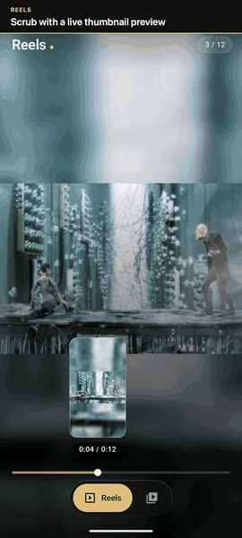

<div align="center">


# 🎬 Android Practice — Compose Videos

**An Instagram-style Reels feed and a YouTube-style floating video player, built entirely with Jetpack Compose and Media3.**

[](https://github.com/nameisjayant/android-learning/actions/workflows/ci.yml)


</div>

---

## 🎥 Demo

<div align="center">

<a href="docs/demo.mp4"></a>

**[▶ Watch the full demo (2:52)](docs/demo.mp4)**, recorded on a Pixel 8

</div>

The full video walks through every feature, with a caption for each:

| Part | What's shown |
|---|---|
| **Reels** | Swipe feed · tap to pause · hold middle to pause / edges for 2× · speed button · mute · scrub with thumbnail · double-tap like · comments · share · ⋮ menu · preloaded swipes |
| **Videos** | Slide-up player · double-tap ±10 s · quality menu (480p) · playback speed · timestamp links · chapter seek bar with frame previews |
| **Full screen** | Full-screen button · brightness / volume swipes · swipe to seek · screen lock and unlock |
| **Autoplay & floating** | Autoplay to the next video · Up Next countdown · floating mini window docked to a corner · picture-in-picture on Home |

> Cast to TV isn't in the recording (no Cast device was on the network). Full-screen clips appear as a landscape strip because Android's screen recorder keeps a portrait frame.

---

## 📖 Table of Contents

- [Demo](#-demo)
- [Features](#-features)
  - [Reels](#-reels)
  - [Videos & Floating Player](#-videos--floating-player)
  - [App-wide](#-app-wide)
- [Architecture](#-architecture)
- [Project Structure](#-project-structure)
- [Tech Stack & Versions](#-tech-stack--versions)
- [Dependencies](#-dependencies)
- [Build Variants](#-build-variants)
- [Getting Started](#-getting-started)
- [Testing](#-testing)
- [CI/CD](#-cicd)
- [Media Credits](#-media-credits)

---

## ✨ Features

### 📱 Reels

| Feature | Details |
|---|---|
| **Vertical swipe feed** | Full-screen `VerticalPager` of 12 bundled 720×1280 reels with snap-to-page paging. |
| **Tap to pause / play** | Single tap toggles playback with an animated play/pause indicator. |
| **Hold gestures** | Hold the **middle** of the video to pause (Instagram), hold the **edges** to play at **2×** (TikTok). |
| **Playback speed** | Speed button cycles **1× → 1.5× → 2× → 0.5×**. |
| **Mute / unmute** | One-tap audio toggle shared across reels. |
| **Scrubbable progress bar** | Drag the progress bar to seek, with a **live thumbnail preview** of the frame above your finger. |
| **Auto-scroll setting** | Choose between looping the current reel or **moving to the next reel** when it ends. |
| **Instant swipes (preloading)** | A pooled-`ExoPlayer` system pre-buffers the next **2 reels** on idle players, so swipes start instantly. |
| **Like & double-tap to like** | Heart button toggles; double-tap only ever likes and plays a heart-burst animation. |
| **Comments sheet** | Bottom sheet with comments, **threaded replies**, **liking comments**, **deleting your own** comments and **pinned** creator comments. |
| **Share** | Opens the Android share sheet and bumps the share count. |
| **⋮ Options menu** | **Not interested** (with *Undo* snackbar) and **Report** with Instagram's list of reasons. |
| **Haptics** | Tactile feedback on like, double-tap, hold and speed change, and while scrubbing. |
| **Error handling** | Loading, error + retry states, and a snackbar naming any reel that fails to play. |

### 🎞️ Videos & Floating Player

| Feature | Details |
|---|---|
| **Video list** | 16:9 thumbnails with duration badges for four Blender open movies. |
| **Smooth open animation** | The player slides up over the app using Material 3 *emphasized* easing curves. |
| **Full player controls** | Play/pause, seek bar and auto-hiding controls (3 s timeout) with gradient scrims. |
| **Double-tap to seek ±10 s** | Double-tap the **left** half to rewind or the **right** half to fast-forward 10 s. Keep tapping on the same side to add 10 s per tap. A curved shaded panel grows in from the edge with **overlapping ripples** from each tap, animated chevrons, a rolling seconds counter and a haptic tick. Drags still swipe the player down, and TalkBack gets *Rewind / Forward 10 seconds* actions. |
| **Quality & speed menu** | A ⚙️ button in the player (portrait and full screen) opens a two-level menu that slides up from the bottom. **Quality** lists the video tracks the clip offers — **Auto (720p)**, **720p**, **480p**, **360p** — read live from `player.currentTracks` and applied as a `TrackSelectionParameters` max-video-size cap, so the choice carries over to the next video. **Playback speed** offers YouTube's **0.25× – 2×** steps. Both survive closing the player, rotation and process death; Back or a tap outside closes the menu. |
| **Full-screen button** | A ⛶ button at the **bottom right** of the player, next to the duration, turns the screen to **landscape** (full screen) and back to **portrait**, however the phone is held. In full screen, **Back** (or the ← arrow) first drops back to portrait instead of closing the player. As on YouTube, the screen holds that orientation until you turn the phone to match, then auto-rotate takes over again, so rotating still works afterwards. With auto-rotate off, the button keeps the hold. Closing the player hands rotation back to the app. |
| **Screen lock** | A 🔒 button in the full-screen player (landscape) locks out every touch so a stray palm can't pause, seek, open the menu or swipe the player away. Back is blocked too. Tapping the screen (or pressing Back) shows a **Screen locked · Tap to unlock** pill for 2.5 s; tap it to get the controls back. The lock survives rotation within full screen and process death, and lets go when you rotate back to portrait, hit a playback error or close the player. TalkBack gets an *Unlock screen* action. |
| **Swipe gestures (full screen)** | In the full-screen player, drag **up / down on the left third** to change **brightness** and **on the right third** to change **volume**. A pill in the middle shows the level as a bar and a percentage, with a haptic tick at 0% and 100%. **Drag sideways anywhere** to seek: one full width of the screen is 90 s, the pill shows **+0:25** with the target time, and the seek happens when you lift your finger. Vertical drags in the middle third still swipe the player down into the floating window. The brightness only applies to the full-screen player: it survives activity recreation but goes back to the system level in portrait, the floating window, PiP, or when the player closes. Volume is the system media volume, so the volume keys and the swipe stay in sync. Turned off while the screen is locked. |
| **Chapters & timestamps** | Each video's description ends with YouTube-style chapter lines (`0:15 A bite of fruit`), placed on the clip's scene cuts. They're read the way YouTube reads them: lines that start with a time, the first at **0:00**, at least **three**, in order, each at least **10 s** long, or no chapters at all. Every time in the description is an **accent-coloured link** that jumps the player there and plays. The **seek bar** breaks into one segment per chapter with a small gap at each start; while you drag, the chapter under your finger swells, its **name shows above the bar**, and a haptic tick marks crossing into the next one. The full-screen swipe-to-seek pill names the target chapter too. |
| **Seek-bar previews** | While you drag the seek bar, a **thumbnail of the frame under your finger** floats above the thumb with the time beneath it, kept inside the bar's ends and larger in full screen. Frames are decoded on-device from the bundled clip with `MediaMetadataRetriever` at the **exact frame** (the clips' keyframes are up to 10 s apart, so seeking to the nearest keyframe would show the wrong scene): one per second, up to 60 per video, 256 px wide. They decode in the background as soon as a video loads, **every eighth one first and then the gaps**, so the whole bar has a rough preview within moments; until a frame is ready the closest decoded one is shown. The strip lives in `VideoPlayerViewModel`, so it survives rotation, and is dropped when the video changes or the player closes. |
| **Up Next & autoplay** | Under the description, an **Up next** queue lists the rest of the videos in the order they'll play (wrapping round, like *next*), each with a thumbnail, duration and title; tap one to play it. An **Autoplay** switch sits in the queue header and survives process death. When a video ends with autoplay on, the next video's thumbnail fades in over the player with **Up next in 5**, a play button whose ring fills over the **5-second countdown**, and **Cancel**. Play starts it now; Cancel (or replaying / seeking) stops the countdown and brings the replay controls back. The floating window shows a small **Next in N** pill, and the countdown stops while the app is in the background and starts over when you return. |
| **In-app floating window** | Drag the player down to shrink it into a **mini floating window** that keeps playing while you browse; drag it to any of the **four corners**, fling to dock, and tap to expand again. **Previous / next** buttons skip between videos without leaving the window. An **expand** button (top left) opens it back up to the full player. |
| **Cast to TV** | A **Cast** button sits in the player's top bar (portrait and full screen) and lists the Chromecasts and Cast-enabled TVs on your Wi-Fi. Pick one and the video moves to the TV **at the same spot, playing or paused as it was**, through Media3's `CastPlayer`, which wraps the phone's `ExoPlayer` and hands playback over in both directions, so the rest of the player keeps talking to one `Player`. The player shows the video's dimmed thumbnail and **Casting to *Living Room TV*** while the controls, seek bar, chapters, seek previews, double-tap seek, speed, previous / next and the up-next countdown all drive the TV; in full screen the right-edge swipe sets the **TV's volume**. The bundled clips live in `res/raw`, which a TV can't reach, so while casting the phone serves them to it over the local network from a small built-in HTTP server (byte ranges for seeking, plus the thumbnail for the TV's loading screen); it starts with the first cast and stops when the session ends. Casting carries on with the app in the background (no pause, no picture-in-picture, the screen may sleep) with a **Cast notification** to control it, and closing the player stops the video but stays connected. Ending the session brings the video back to the phone where the TV left off. Plays on Google's **Default Media Receiver**; the phone and TV need to be on the same Wi-Fi. |
| **Picture-in-Picture** | Leaving the app while a video plays continues it in a system **PiP window** with **previous, play/pause and next** actions — auto-enter on Android 12+, `onUserLeaveHint` on older versions. |
| **State survives rotation** | Player position, collapse state and docked corner are saved with a custom `Saver`. |

### 🧭 App-wide

- **Bottom tab bar** (Reels / Videos) that tucks away under the full-screen player and slides back with the mini player.
- **Type-safe navigation** with `@Serializable` routes.
- **Edge-to-edge**, dark media theme.
- **Logo & splash screen** — a champagne play button inside a seek ring, with the playhead riding its edge. Adaptive launcher icon with a themed (monochrome) layer for Android 13+, plus raster fallbacks for API 24–25. The splash uses `core-splashscreen`: on Android 12+ the ring draws itself, the playhead follows it and the play button pops in; older versions show the static mark. It then grows and fades into the app.
- **Fully offline** — every clip ships inside `res/raw`, no network needed.

---

## 🏛️ Architecture

The app follows **MVI (Model–View–Intent)** on top of a lightweight **Clean Architecture** split into `data` → `presentation` per feature, wired together with **Hilt**.

```
┌──────────────────────────────────────────────────────────────┐
│                       Composable (View)                      │
│   collects  StateFlow<State>      sends  onIntent(Intent)    │
│   collects  Flow<Effect> (one-off: snackbar, share sheet)    │
└───────────────▲──────────────────────────────┬───────────────┘
                │ State / Effect               │ Intent
┌───────────────┴──────────────────────────────▼───────────────┐
│                    ViewModel (@HiltViewModel)                │
│   MutableStateFlow<State>  ·  Channel<Effect>  ·  reducer    │
└───────────────────────────────┬──────────────────────────────┘
                                │ suspend calls
┌───────────────────────────────▼──────────────────────────────┐
│          Repository interface  ←  RepositoryImpl             │
│            (runs on injected @IoDispatcher)                  │
└───────────────────────────────┬──────────────────────────────┘
                                │
                     Bundled media in res/raw
```

### Building blocks

| Piece | Role | Example |
|---|---|---|
| **State** | Immutable `data class`, the single source of truth for a screen. | `ReelsState`, `VideosState`, `VideoPlayerState` |
| **Intent** | `sealed interface` of everything the user (or player) can tell the screen. | `ReelsIntent.ToggleLike`, `ReelsIntent.CycleSpeed` |
| **Effect** | One-off events that must not survive recomposition or rotation, delivered via a `Channel`. | `ReelsEffect.ShowMessage`, `ReelsEffect.ShareReel` |
| **ViewModel** | Single `onIntent()` entry point that reduces intents into new state with `_state.update { … }`. | `ReelsViewModel`, `VideoPlayerViewModel` |
| **Repository** | Interface the ViewModel depends on; the implementation can be swapped for a network source later. | `ReelsRepository` / `ReelsRepositoryImpl` |
| **DI modules** | Hilt `@Module`s bind repositories and provide the qualified IO dispatcher. | `ReelsModule`, `VideosModule`, `DispatchersModule` |

### Key design decisions

- **Unidirectional data flow** — UI never mutates state; it only sends intents.
- **Player pooling** — `ReelPlayerPool` leases and recycles `ExoPlayer` instances (max 2 idle) instead of creating one per page, and pre-warms upcoming reels.
- **UI-only state stays in the UI** — gesture/animation state like `PlayerSheetState` (collapse, corner, drag offset) lives in Compose, hoisted to the activity so the tab bar can react to it.
- **Testable by design** — dispatchers are injected and repositories are interfaces, so ViewModels are unit-tested with fakes.

---

## 🗂️ Project Structure

```
app/src/main/java/com/nameisjayant/composevideos/
├── AndroidPracticeApplication.kt      # @HiltAndroidApp
├── MainActivity.kt                    # Hosts NavHost, bottom bar & floating player
├── ui/theme/                          # Color, Type, Theme
└── media/
    ├── di/DispatchersModule.kt        # @IoDispatcher qualifier
    ├── navigation/                    # MediaRoute, MediaNavHost, MediaBottomBar, MediaTransitions
    ├── ui/MediaTheme.kt
    ├── reels/
    │   ├── data/                      # Reel, ReelComment, ReelsRepository
    │   ├── di/ReelsModule.kt
    │   └── presentation/              # ReelsContract, ReelsViewModel, ReelsScreen,
    │                                  # ReelPlayer (pool), ReelScrubber, ReelComments, ReelOptions
    └── videos/
        ├── data/                      # Video, Chapter (timestamp & chapter parsing), VideosRepository,
        │                              # SeekPreviews (seek-bar frames via MediaMetadataRetriever),
        │                              # VideoCast (Cast options, media item converter),
        │                              # CastMediaServer (serves bundled clips to the TV)
        ├── di/VideosModule.kt
        └── presentation/              # VideosContract, VideosViewModel, VideosScreen,
                                       # VideoPlayerViewModel, VideoPlayerOverlay,
                                       # PlayerSheetState, VideoPictureInPicture,
                                       # VideoSeekGestures (double-tap seek + ripple),
                                       # VideoSwipeGestures (brightness / volume / seek swipes),
                                       # VideoPlaybackSettings (quality & speed menu),
                                       # VideoChapters (chapter seek track, linked description),
                                       # VideoSeekPreview (thumbnail over the seek bar),
                                       # VideoOrientation (full-screen button / Back rotation),
                                       # VideoCast (Cast button, "Casting to" backdrop)
```

---

## 🛠️ Tech Stack & Versions

| Tool | Version |
|---|---|
| **Android Studio** | 2026.1.4 (build `AI-261.26222.65`) |
| **Kotlin** | 2.4.21 |
| **Android Gradle Plugin (AGP)** | 9.4.1 |
| **Gradle** | 9.6.0 |
| **KSP** | 2.3.12 |
| **Java compatibility** | 11 |
| **compileSdk / targetSdk** | 37 |
| **minSdk** | 24 (Android 7.0) |
| **UI** | Jetpack Compose + Material 3 |
| **DI** | Hilt (Dagger) |
| **Async** | Kotlin Coroutines & Flow |
| **Media** | AndroidX Media3 ExoPlayer + Media3 UI Compose + Media3 Cast |
| **Navigation** | Navigation Compose with type-safe `@Serializable` routes |

---

## 📦 Dependencies

All versions are managed in [`gradle/libs.versions.toml`](gradle/libs.versions.toml).

### Gradle plugins

| Plugin | ID | Version |
|---|---|---|
| Android Application | `com.android.application` | 9.4.1 |
| Kotlin Compose Compiler | `org.jetbrains.kotlin.plugin.compose` | 2.4.21 |
| Kotlin Serialization | `org.jetbrains.kotlin.plugin.serialization` | 2.4.21 |
| KSP | `com.google.devtools.ksp` | 2.3.12 |
| Hilt | `com.google.dagger.hilt.android` | 2.60.1 |
| Foojay Toolchain Resolver | `org.gradle.toolchains.foojay-resolver-convention` | 1.0.0 |

### Libraries

| Category | Library | Version |
|---|---|---|
| **Core** | `androidx.core:core-ktx` | 1.19.1 |
| | `androidx.core:core-splashscreen` | 1.2.0 |
| | `androidx.activity:activity-compose` | 1.13.0 |
| **Compose** | `androidx.compose:compose-bom` | 2026.09.00 |
| | `androidx.compose.ui:ui`, `ui-graphics`, `ui-tooling-preview` | via BOM |
| | `androidx.compose.material3:material3` | via BOM |
| **Lifecycle** | `androidx.lifecycle:lifecycle-runtime-ktx` | 2.11.0 |
| | `androidx.lifecycle:lifecycle-runtime-compose` | 2.11.0 |
| | `androidx.lifecycle:lifecycle-viewmodel-compose` | 2.11.0 |
| **Navigation** | `androidx.navigation:navigation-compose` | 2.10.2 |
| | `org.jetbrains.kotlinx:kotlinx-serialization-json` | 1.11.0 |
| **Dependency Injection** | `com.google.dagger:hilt-android` | 2.60.1 |
| | `com.google.dagger:hilt-compiler` (KSP) | 2.60.1 |
| | `androidx.hilt:hilt-lifecycle-viewmodel-compose` | 1.4.0 |
| **Coroutines** | `org.jetbrains.kotlinx:kotlinx-coroutines-android` | 1.11.0 |
| **Media** | `androidx.media3:media3-exoplayer` | 1.11.1 |
| | `androidx.media3:media3-ui-compose` | 1.11.1 |
| | `androidx.media3:media3-cast` | 1.11.1 |

### Testing

| Library | Version |
|---|---|
| `junit:junit` | 4.13.2 |
| `org.jetbrains.kotlinx:kotlinx-coroutines-test` | 1.11.0 |
| `androidx.test.ext:junit` | 1.3.0 |
| `androidx.test.espresso:espresso-core` | 3.7.0 |
| `androidx.compose.ui:ui-test-junit4` | via BOM |
| `androidx.compose.ui:ui-test-manifest` *(debug)* | via BOM |
| `androidx.compose.ui:ui-tooling` *(debug)* | via BOM |

---

## 🧪 Build Variants

The app has an `environment` flavor dimension:

| Flavor | Application ID | App name | Notes |
|---|---|---|---|
| **beta** | `com.nameisjayant.composevideos.beta` | Android Practice Beta | `-beta` version suffix; installs side-by-side with prod |
| **prod** | `com.nameisjayant.composevideos` | Android Practice | Production build |

Combined with `debug` / `release` build types → `betaDebug`, `betaRelease`, `prodDebug`, `prodRelease`.

---

## 🚀 Getting Started

### Prerequisites

- **Android Studio 2026.1.4** or newer
- **JDK 17+** (bundled JBR from Android Studio works)
- Android SDK **Platform 37**

### Clone & run

```bash
git clone <repo-url>
cd AndroidPractice

# Build & install the beta debug build on a connected device / emulator
./gradlew installBetaDebug

# Or the production debug build
./gradlew installProdDebug
```

Or simply open the project in Android Studio, pick a build variant from **Build Variants**, and hit ▶ **Run**.

> 💡 Picture-in-Picture requires a device or emulator that supports it (Android 8.0+).
>
> 📺 Casting needs Google Play services on the phone and a Chromecast or Cast-enabled TV on the same Wi-Fi network (one that lets devices reach each other, so not most guest networks).

---

## ✅ Testing

ViewModels are covered by JVM unit tests using fake repositories and `kotlinx-coroutines-test`:

- **`ReelsViewModelTest`** — loading & retry, page settling, hold gestures, mute, playback errors, like vs. double-tap, comments, replies, comment likes, deleting only your own comments, share, not interested / undo and report.
- **`VideosViewModelTest`** — loading and error-retry.
- **`ChaptersTest`** — chapter parsing and YouTube's rules (starts at 0:00, at least three, in order, 10 s minimum), timestamp links in running text, and the chapter at a given position.
- **`SeekPreviewsTest`** — coarse-to-fine decode order covering every frame once, and picking the closest decoded frame (clamped at the ends) while the rest load.
- **`CastMediaServerTest`** — the cast server's HTTP request parsing and byte ranges (closed, open-ended, suffix, clamped past the end, and the ones it refuses).

```bash
./gradlew testBetaDebugUnitTest
```

---

## 🔄 CI/CD

Two GitHub Actions workflows live in [`.github/workflows`](.github/workflows):

| Workflow | Runs on | What it does |
|---|---|---|
| **[CI](.github/workflows/ci.yml)** | Every push to `main`, every pull request, or manually | Lint (`lintBetaDebug`, `lintProdDebug`) → unit tests for both flavors → builds the beta debug and prod release APKs. Lint/test reports and the APKs are attached to the run as artifacts. A newer push cancels the run still in progress. |
| **[Release](.github/workflows/release.yml)** | Pushing a `v*` tag | Runs the unit tests, builds the prod and beta release APKs and publishes them on a GitHub Release with auto-generated notes. |

Both use JDK 21 (Temurin) and `gradle/actions/setup-gradle`, which validates the Gradle wrapper and caches dependencies between runs.

To cut a release:

```bash
git tag v1.0.0
git push origin v1.0.0
```

> 🔑 Release builds are still signed with the debug key (see `app/build.gradle.kts`), so the released APKs are for sideloading/testing, not the Play Store.

Run the same checks locally before pushing:

```bash
./gradlew lintBetaDebug lintProdDebug testBetaDebugUnitTest testProdDebugUnitTest assembleBetaDebug assembleProdRelease
```

---

## 🎥 Media Credits

All bundled clips are cut from **Blender Foundation open movies**, licensed under [CC BY 3.0](https://creativecommons.org/licenses/by/3.0/). The channel credit is kept visible in-app as the license requires.

Each Videos-tab clip is a single MP4 with three video tracks — the original **720p** plus re-encoded **480p** (~400 kbps) and **360p** (~220 kbps) — sharing one audio track, so the quality menu has real renditions to switch between offline.

- **Big Buck Bunny** (2008) — © Blender Foundation | peach.blender.org
- **Sintel** (2010) — © Blender Foundation | durian.blender.org
- **Tears of Steel** (2012) — © Blender Foundation | mango.blender.org
- **Elephants Dream** (2006) — © Blender Foundation / Netherlands Media Art Institute | orange.blender.org

---

<div align="center">

Made with ❤️ and Jetpack Compose by **[Jayant Kumar](https://github.com/name-is-jayant)**

</div>
